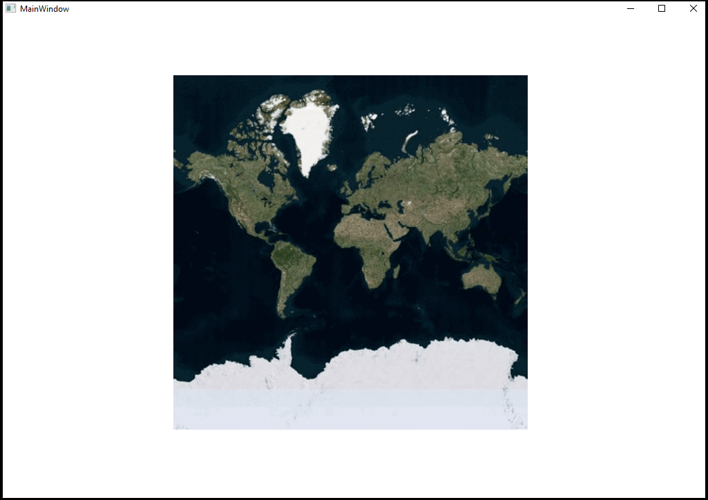

# How to view the Bing map in WPF maps

This article explains how to show the external geospatial imagery resources for deep-zoom satellite viewing (Bing Map) in Syncfusion WPF map control, as shown in the following image. 

 

 Please refer the below KB for more 

 [How to view the Bing map in WPF maps](https://www.syncfusion.com/kb/10799/?utm_medium=listing&utm_source=github-examples)

This can be achieved by using the LayerType property in ImageryLayer as shown in the following steps:

**Step 1:** To enable this feature, define Bing as LayerType.

**Step 2:** Provide the bing Map Key to the BingMapKey property and that key has been obtained from this link.

**Step 3:** Provide the desired BingMapStyle from the available three types:

1.	Aerial View
2.	Road View and
3.	AerialWithLabel View

Please refer the following code reference, for more details.

[XAML]
```
        <syncfusion:SfMap>
            <syncfusion:SfMap.Layers>
                <syncfusion:ImageryLayer LayerType="Bing" BingMapKey="Your Bing Map Key " BingMapStyle="Aerial" />
            </syncfusion:SfMap.Layers>
        </syncfusion:SfMap>
```

[C#]

```
SfMap syncMap = new SfMap();
ImageryLayer imageryLayer = new ImageryLayer()
{
LayerType = LayerType.Bing,
BingMapKey = "Your Bing Map key",
BingMapStyle = BingMapStyle.Aerial,
};
syncMap.Layers.Add(imageryLayer);
```	

See also

[Interact with shapes on SfMaps](https://help.syncfusion.com/wpf/maps/map-selection)

[To display item on a map](https://help.syncfusion.com/wpf/maps/displaying-items-on-a-map)

[To load multiple shape files on SfMaps](https://help.syncfusion.com/wpf/maps/multilayer-support)

